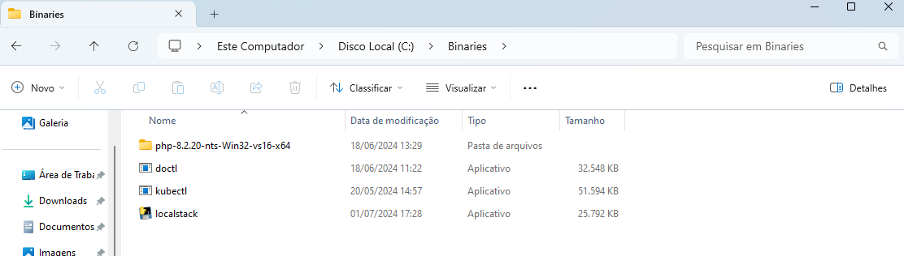
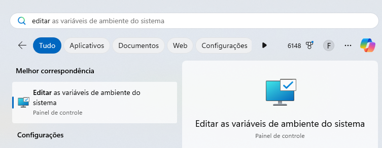
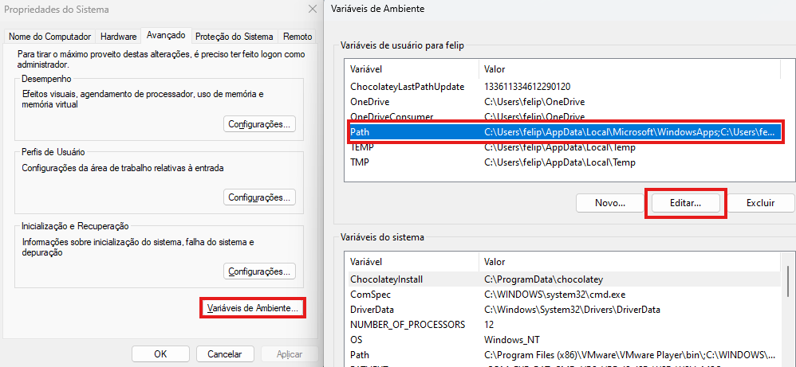
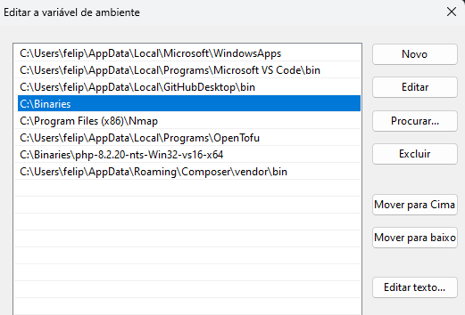

# Introdução
---
## Ambientes de laboratório
### Objetivos
- Instalar o WSL na máquina que usará para estudos (se estiver usando Windows);
- Instalar o VirtualBox e o Vagrant para executarmos laboratórios locais;
- Criar uma conta em uma nuvem pública para executarmos laboratórios remotos (atenção aos custos! Não me responsabilizo!);
- Instalar o Terraform para provisionamento da infraestrutura remota;
---
### WSL - Windows Subsystem Linux
O WSL é um subsistem Linux que roda diretamente pelo Windows, sem precisarmos instalar uma máquina virtual ou utilizar um sistema em nuvem. Além de ser muito útil para laboratórios, ainda temos um sistema Linux inteiro para usar dentro do Windows de forma prática. Muito útil para desenvolvedores e profissionais DevOps.

O WSL permite executar diversas distribuições Linux, muitas que podem ser instaladas diretamente da loja da Microsoft (mas também é possível instalar sistemas de fora da loja).

#### Instalação do WSL
Hoje em dia, tornou-se muito mais prático realizar a instalação do WSL e pode ser alcançada facilmente com apenas um comando executado via PowerShell.
```sh
wsl --install
```

O comando acima, executado no PowerShell, como administrador, irá instalar todas as dependências necessárias e configurar uma distribuição Ubuntu no computador.

#### Oh My ZSH
Oh My ZSH é um emulador de terminal que facilita (muito) a vida de quem precisa utilizar a CLI do Linux diariamente. Além de ser mais colorido que o Bash, que é o terminal padrão (todos sabemos que o pesosal de TI gosta de terminais e leds coloridos).

Sua instalação é bem simples, bastando copiar e colocar os comandos abaixo:
```bash
sudo apt update -y
sudo apt install zsh
sh -c "$(curl -fsSL https://raw.githubusercontent.com/ohmyzsh/ohmyzsh/master/tools/install.sh)"
```

Digitando sua senha de usuário quando for solicitado e, após o último comando, confirmando pressionando Y. Assita ao vídeo caso deseje ver como alterar o tema padrão do terminal, mas não é um passo necessário.

### VirtualBox
O VirtualBox é um Hypervisor tipo 2 muito conhecido pela sua praticidade e por não ter custo. Muito útil para criação de laboratórios mais complexos onde são necessários diversos sistemas se comunicando via rede. Sua instalação é muito simples, como qualquer software no Windows, basta realizar o download do instalador [aqui](https://www.virtualbox.org/wiki/Downloads) e executá-lo.

Baixe também o ``Extension Pack``, disponível na mesma página e o instale após o VirtualBox estar funcionando.

#### Vagrant
Aliado ao VirtualBox, vamos utilizar o programa Vagrant, que é um utilitário que permite realizar a codificação da infraestrutura (aquilo que você deve ter ouvido como IaC, Infra as Code, Infraestrutura como código), pode ser algo que pareça avançado, mas acredite em mim, é o que o mercado demanda. E estudar Linux nunca foi uma tarefa fácil mesmo.

##### Windows
Sua instalação segue a instalação padrão de qualquer aplicativo Windows, basta ir neste [link](https://developer.hashicorp.com/vagrant/install?product_intent=vagrant) e realizar o download do arquivo MSI para Windows.

##### Linux
Se você já estiver utilizando o Linux no seu computador para estudos, na mesma página de Download do Windows você encontra as instruções para Linux, basta copiar os comandos e colar no terminal. Se você estiver usando apenas o WSL, não é necessário fazer este passo.

### Nuvem Pública
Bem, vamos praticar no ambiente local, mas, minha intenção é te ensinar como usamos o Linux profissionalmente e isso inclui infraestrutura como código, Docker, pipelines de CI/CD e Nuvem.

Temos diversas opções disponíveis de nuvem para usar, vou listar algumas:
- AWS
- Google Cloud Plataform
- Azure
- Oracle Cloud
- Huawei Cloud

Entre diversas outras. Bem, você poderá escolher a que quiser, mas já aviso, não me responsabilizo pelos custos das plataformas! Portanto, leia e entenda os limites gratuitos delas. 

A plataforma que irei utilizar nos meus exemplos é a Digital Ocean. Por que? É simples, barata e se você se cadastrar pelo meu link você recebe 200 USD de créditos para usar dentro de 60 dias. Depois disso, ela irá te cobrar pelos recursos.

Mas Felipe, as outras plataformas tem máquinas que chamam de sempre gratuitas, porque eu deveria utilizar a Digital Ocean então? Gafanhoto, as máquinas gratuitas normalmente tem 1vCPU e 512MB de RAM, e você ainda pagará pelo tráfego de rede, os 200 USD da Digital Ocean irá permitir você testar a vontade a aplicação em uma máquina muito mais robusta (ou máquinas!).

Se cadastre usando este [link](https://m.do.co/c/a008414ecfc9) e receba seus 200 USD de créditos.

Atenção! Você não precisa realizar o cadastro agora, pois vamos usar apenas nos módulos de bootcamp.

#### Terraform
Assim como usaremos o Vagrant para provisionar a nossa infraestrutura local, usaremos o Terraform para provisionar a nossa infraestrutura em nuvem. E advinhe só, ele é da mesma empresa do Vagrant!

##### Windows
Acesse a [página de download](https://developer.hashicorp.com/terraform/install?product_intent=terraform) e baixe o arquivo executável. Ele não precisa ser instalado, portanto, basta cópia-lo para uma pasta que a PATH do sistema está configurada. 

O que eu gosto de fazer é o seguinte:
- Criar um diretório chamado ``binaries`` diratamente no C:

- Pesquisar por ``Editar as variáveis de ambiente do sistema`` na busca do iniciar

- Clicar no botão ``Variáveis de Ambiente``, na janela que abrir, selecionar a ``PATH`` e clicar no botão ``Editar``.

- Na janela que abrir, clicar em novo e digitar o caminho ``C:\Binaries``


Pronto! Basta fechar os terminais que já estão abertos e abrí-los novamente. Qualquer executável que for colocado dentro do diretório ``Binaries``, o sistema terá acesso e será possível executar diretamente da CLI.

##### WSL ou Linux
Na mesma página de instalação do Windows, temos acesso aos comandos necessários para instalar em distribuições Linux, basta copiá-los e colá-los em algum terminal Linux. Abaixo, estão os comandos necessários para instalar no WSL Ubuntu que criamos posteriormente.
```bash
wget -O- https://apt.releases.hashicorp.com/gpg | sudo gpg --dearmor -o /usr/share/keyrings/hashicorp-archive-keyring.gpg
echo "deb [signed-by=/usr/share/keyrings/hashicorp-archive-keyring.gpg] https://apt.releases.hashicorp.com $(lsb_release -cs) main" | sudo tee /etc/apt/sources.list.d/hashicorp.list
sudo apt update && sudo apt install terraform
```

Caso ocorra algum erro referente ao sistema não encontrar o comando ``wget``, execute:
```bash
sudo apt update -y
sudo apt install -y wget
```

Ao longo do curso, vamos aprender exatamente o que cada comando executa!
